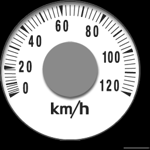
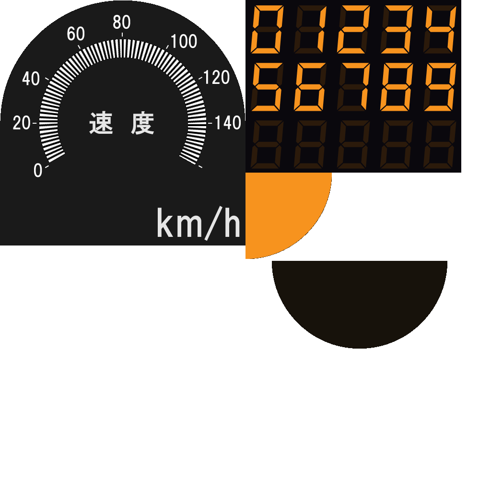
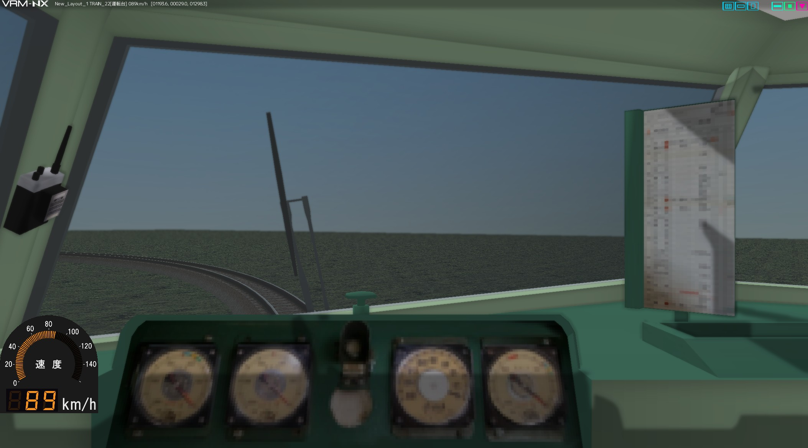

# 速度計スプライトの基本と応用

ATENXAでは、スプライトでビュワー画面上に速度計を簡単に表示するための機能を atenxa.meter サブパッケージで提供しています。

ATENXAのパッケージ内に、シンプルな速度計の実装例が同梱されています。 (MeterSimpleクラス。)
テクスチャーをリソースに登録して、数行のスクリプトを記述するとすぐに使えます。複雑な座標計算や、スプライトのコーディングを考える必要はありません。

また、ATENXAのコードを拡張して、独自様式の速度計を開発することもできます。
本ページではその作例として、JR西日本681系電車風のデジタル160km/hメーターを紹介します。

## シンプルな速度計を使ってみる

シンプルな速度計の機能は、 atenxa.meter.simple.MeterSimple クラスに実装されています。

### リソースの登録

速度計のパーツを書き込んだpngテクスチャーを編成リソースに登録します。
ID=1とします。



### 有効化

速度計を表示したい編成の編成スクリプトにスクリプトを追記します。

```python
#OBJID=35
import vrmapi

import atenxa.meter

def vrmevent_35(obj,ev,param):
    atenxa.meter.activate(obj,ev,param, atenxa.meter.MeterSimple, res=1)
    # 以下省略
```

atenxa.meter パッケージをimportします。 activate関数を利用します。

atenxa.meter.activate関数の使い方は次のとおりです：

```python
atenxa.meter.activate(train, ev, param, MeterClass, res, layoutres=False)
```

* **train**: 対象の編成オブジェクト
* **ev**: 編成のイベントハンドラに来るイベントコード
* **param**: 編成のイベントハンドラに来るパラメータ
* **MeterClass**: 使用する速度計のクラス
* **res**: 速度計テクスチャのリソースID
* **layoutres** _(optional)_: Trueでレイアウトのリソースを参照します。デフォルト(False)は編成のリソースを参照します。 

最初の3つ (`train`, `ev`, `param`) は、イベントハンドラの `obj` `ev` `param` をそのまま渡します。

`MeterClass` にはクラスオブジェクトを与えます。（インスタンスではないよ！）

`res` で、編成に登録したPNGリソースのIDを指定します。

### 結果

略。

## オリジナルの速度計の開発

MeterSimpleの速度計はあまりにシンプル過ぎます。
お好みの車両形式にはマッチしないかもしれませんが、
テクスチャを書き換えただけでは役不足なこともあるでしょう。

そんなときは、 `MeterBase` （ATENXA式速度計スプライトシステムのベースクラス）
または `MeterSimple` のサブクラスを作って、
必要なところだけ作り込むという方法があります。

ここでは、JR西日本681系電車風のデジタル160km/hメーターの作例を紹介します。

* 3桁デジタルゲージ
* 円弧状のLED式ゲージ

130km/hを超えて走行可能であることを表すGG現示車内信号灯は省略です。

### テクスチャーの作成



### メータークラスの作成

メーター制御用のクラスを、 `MeterBase` もしくは `MeterSimple` を継承したサブクラスとして作ります。 `MeterSimple` を継承して作るほうがラクだと思います。

atenxa内のファイルを加工すると競合する可能性や著作権上の支障が出るため、
atenxaとは別に meter_west160.py ファイルに記述します。

ファイルを以下のように配置します。
（説明の都合上、最小例としています。
リポジトリ内のexampleフォルダとは別の構成です。）

```text
(root)
├ YourLayout.vrmnx
├ atenxa
├ meter_west160.py
└ meter160km_nx.png
```

`setup` メソッドと `display` メソッドに、スプライトの制御部分を書き込みます。

`setup` メソッドは、`init` イベントのときに1度だけ実行されます。 `self.new_sprite()` で読み込んだスプライトオブジェクトをインスタンス変数に保存し、UV座標等の共通設定を行います。

`display` メソッドは、 `frame` イベントで毎フレーム実行されます。
速度に応じてスプライトを変形させる処理を実装します。

詳細は、 `MeterBase` `MeterSimple` のリファレンスと、
meter_west160.py のサンプルコードを参照してください。

### レイアウターでの作業

#### テクスチャーをリソースに登録する

略。リソースID=1に登録したとします。

#### スクリプトの記述

編成スクリプトにコードを記述します。

```python
#OBJID=35
import vrmapi

# レイアウトと同じディレクトリのpythonスクリプトを優先的にインポートする
import os, sys
sys.path.insert(0, vrmapi.SYSTEM().GetLayoutDir())

import atenxa.meter
from meter_west160 import MeterWest160

def vrmevent_35(obj,ev,param):
    atenxa.meter.activate(obj,ev,param, MeterWest160, res=1)
    # 以下省略
```

### 出来上がり


